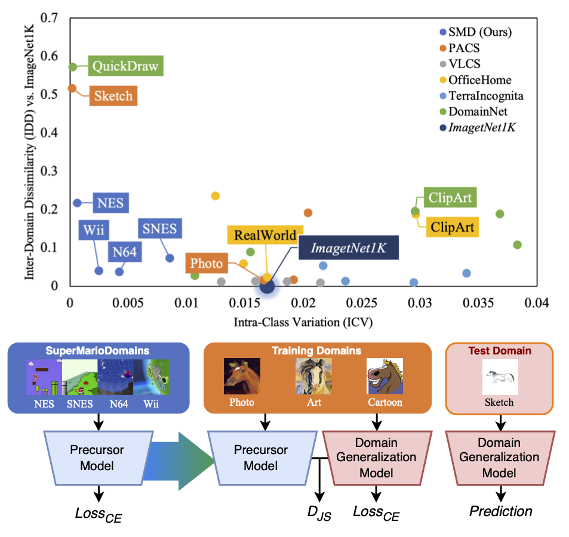

# SMD-SMOS: Grounding Stylistic Domain Generalization with Quantitative Domain Shift Measures and Synthetic Scene Images (CVPR Workshop 2024)


[](https://arxiv.org/abs/2405.15961) 
[](https://drive.google.com/drive/folders/1NEaivgm9MZA9O9jTQXecrlKdUny4UzVd?usp=sharing) 
[](https://huggingface.co/datasets/fpsluozi/SuperMarioDomains) 
[](https://github.com/fpsluozi/SMD-SMOS) 
[](https://huggingface.co/datasets/fpsluozi/SuperMarioDomains/resolve/main/vdu_poster.pdf)
[](https://huggingface.co/datasets/fpsluozi/SuperMarioDomains/resolve/main/vdu_talk.pptx)
<!-- [](https://drive.google.com/drive/folders/1NEaivgm9MZA9O9jTQXecrlKdUny4UzVd?usp=sharing)  -->

Official implementation of [Grounding Stylistic Domain Generalization with Quantitative Domain Shift Measures and Synthetic Scene Images](https://arxiv.org/abs/2405.15961) (Best Paper at [the 3rd VDU Workshop @ CVPR 2024](https://sites.google.com/view/vdu-cvpr24/)). 




# 🏃 Running SMOS

## 🧱 Requirements
```
gdown==4.7.1
numpy==1.23.5
opencv_python==4.7.0.72
Pillow==10.4.0
prettytable==3.10.2
sconf==0.2.5
tensorboardX==2.6
torch==2.0.1
torchvision==0.15.2
git+https://github.com/openai/CLIP.git
```

## 🛠️ Downloading the Precursor Checkpoints

PyTorch precursor checkpoints pre-trained with SMD and [DomainNet](https://ai.bu.edu/M3SDA/#dataset) are available at [Google Drive](https://drive.google.com/drive/folders/1NEaivgm9MZA9O9jTQXecrlKdUny4UzVd?usp=sharing) and [HuggingFace](https://huggingface.co/datasets/fpsluozi/SuperMarioDomains/tree/main/precursor). 

By default, the precursors are placed under `precursor/`.

## ⌛ Benchmarking

Make sure you have the proper DG benchmark datasets placed under `datadir/`. 

To run the default **SMOS+** pipeline over [PACS](https://www.v7labs.com/open-datasets/pacs), you may use:

```
python3 train_smos.py "test_run" --data_dir "datadir/" \
    --work_dir "./output/" \
    --project_name "SMOS_PACS" \
    --algorithm "SMOS_JS" \
    --dataset "PACS" \
    --ld_KL 0.15 \
    --lr 3e-5 \
    --steps 5001 --model_save 5000 \
    --resnet_dropout 0.0 \
    --weight_decay 0.0 \
    --checkpoint_freq 200 \
    --smos_pre_featurizer_pretrained True \ 
    --smos_pre_featurizer_path "./precursor/SMD_PT_4800.pth"

```

Alternatively, **SMOS-** is simply using an SMD-pretrained-from-scratch precursor with:

```
    --smos_pre_featurizer_path "./precursor/SMD_Scratch_4800.pth"
```

Please find `train_smos_PACS_pt.sh` for a sample parameter sweeping script.

# 🧑‍🏫 Obtaining the Precursor / Teacher Model on Your Own

## 🍄 SMD Dataset 

Our synthetic precursor training dataset SMD is available [here](https://huggingface.co/datasets/fpsluozi/SuperMarioDomains). By default, the SMD domain folders are placed under `datadir/smd/`.

## 🧑‍🎓 Training a Custom Precursor Feature Extractor

Training a precursor feature extraction ResNet50 model with all 4 domains of SMD using ERM:

```
python3 train_precursor.py "SMD_ERM_pre" --data_dir "datadir/" \
    --work_dir "./output_precursor/" \
    --project_name "SMD_precursor" \
    --algorithm "ERM" \
    --dataset "SMD" \
    --ld_KL 0.0 \
    --lr 1e-5 \
    --steps 5001 --model_save 2000 \
    --resnet_dropout 0.0 \
    --weight_decay 0.0 \
    --checkpoint_freq 200 \
    --pretrained True \
    --smos_pre_featurizer_pretrained False
```

To obtain a Precursor from scratch, simply set `--pretrained False`.

# 🙏 Citation

If you find our work useful, please refer to it with:
```
@InProceedings{Luo_2024_CVPR,
    author    = {Luo, Yiran and Feinglass, Joshua and Gokhale, Tejas and Lee, Kuan-Cheng and Baral, Chitta and Yang, Yezhou},
    title     = {Grounding Stylistic Domain Generalization with Quantitative Domain Shift Measures and Synthetic Scene Images},
    booktitle = {Proceedings of the IEEE/CVF Conference on Computer Vision and Pattern Recognition (CVPR) Workshops},
    month     = {June},
    year      = {2024},
    pages     = {7303-7313}
}
```


# 📒 Acknowledgements

This project is based off [DomainBed](https://github.com/facebookresearch/DomainBed) (MIT license) and
[MIRO](https://github.com/khanrc/swad) (MIT license).
